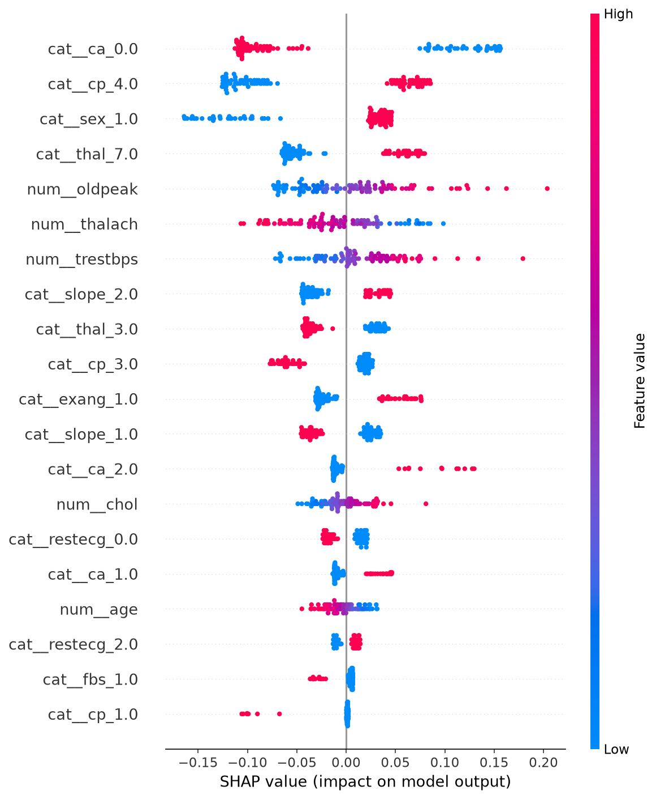

# Cardiac Risk Classification

A classical supervised-ML pipeline that classifies cardiac-disease risk from
tabular clinical features, built with the rigor expected of a healthcare-adjacent
data-science project: stratified splitting, cross-validated model selection,
imbalance-aware metrics, explainability, and explicitly stated limitations.

> ⚠️ **This is not a diagnostic tool.** It is a portfolio demonstration of a
> healthcare ML pipeline trained on a small, decades-old research dataset. It
> does **not** predict real-world heart-disease risk for actual patients and
> must **never** be used for clinical decisions.

## Why classical ML, not a CNN/RNN

The standard cardiac-risk datasets are **tabular** — ~13 structured clinical
measurements per patient (age, chest-pain type, resting blood pressure,
cholesterol, ECG results, max heart rate, …), not images or sequences. A
CNN/RNN here would be technically unjustified: deep learning brings no advantage
on a few hundred rows of structured features and would signal modeling for
impressiveness rather than fit. This project deliberately sweeps **nine classical
classifiers** — logistic regression, decision tree, Random Forest, gradient
boosting, XGBoost, LightGBM, SVM (RBF), KNN, and Gaussian Naive Bayes — the right
family of tools for tabular data, and treats that choice as a defensible
engineering decision.

## Dataset and its limitations

**UCI Heart Disease — Cleveland subset** (303 patients, 13 features). The raw
target `num` is a 0–4 severity score; we use the conventional **binary** cut
(`0` = no disease, `1` = disease present). Class balance is mild: ~54% / 46%.

Real limitations, stated up front:

- **Small sample** — 303 patients; metrics carry wide confidence intervals.
- **Single hospital** — Cleveland Clinic only; no external/geographic validation.
- **Demographic skew** — older, predominantly male cohort; not representative.
- **Age of the data** — collected in the late 1980s; clinical practice, imaging,
  and population baselines have all changed since.

These constraints are why the framing is "a rigorously built pipeline," not "an
accurate risk predictor."

## Architecture

```
src/
  data/load_data.py          UCI loader, schema validation, missing-value handling
  features/preprocessing.py  scaling, one-hot encoding, stratified split
  models/                    per-algorithm pipeline builders (logreg, RF, GBM, …)
  clustering/                KMeans patient segmentation — exploratory, kept separate
  evaluation/metrics.py      ROC-AUC, precision/recall, confusion, cross-validation
  explainability/            SHAP feature importance for the winning model
  train.py                   end-to-end: 9-model MLflow sweep → metrics.csv + SHAP + models/
api.py                       FastAPI service: serves the frontend + /health + /predict
index.html + support.js      interactive frontend (drag-to-swap models, live KPIs/SHAP)
app/Home.py                  optional Streamlit risk-input demo (thin UI over src/)
render.yaml                  single-service Render deploy (frontend + API together)
tests/                       preprocessing, metrics, fit/predict, and shared-fold contracts
notebooks/eda.ipynb          exploration only — the real pipeline lives in src/
```

The modeling logic lives entirely in `src/`; `api.py` serves the trained models
and the static frontend from one origin, mirroring the engine/app split used
elsewhere in the portfolio.

## Results

All **nine** classifiers are swept under **one shared `StratifiedKFold(n_splits=5,
random_state=42)`** — the exact same fold indices for every model (a test
asserts this), so the comparison is fair. Each metric is the **mean ± std across
the 5 folds**, not a single split. Because the classes are only mildly balanced,
the headline metric is **ROC-AUC** alongside precision/recall, not accuracy.

| Model | ROC-AUC (CV) | F1 | Precision | Recall | Accuracy |
|-------|-------------:|---:|----------:|-------:|---------:|
| **Logistic Regression** | **0.918 ± 0.022** | 0.831 | 0.860 | 0.805 | 0.851 |
| Random Forest | 0.914 ± 0.024 | 0.825 | 0.857 | 0.798 | 0.845 |
| SVM (RBF) | 0.902 ± 0.032 | 0.832 | 0.848 | 0.820 | 0.848 |
| XGBoost | 0.892 ± 0.016 | 0.802 | 0.825 | 0.784 | 0.822 |
| Gaussian Naive Bayes | 0.892 ± 0.033 | 0.815 | 0.850 | 0.784 | 0.838 |
| LightGBM | 0.890 ± 0.017 | 0.784 | 0.818 | 0.755 | 0.809 |
| KNN | 0.885 ± 0.032 | 0.823 | 0.845 | 0.806 | 0.842 |
| Gradient Boosting | 0.878 ± 0.025 | 0.769 | 0.791 | 0.755 | 0.792 |
| Decision Tree | 0.748 ± 0.066 | 0.731 | 0.732 | 0.733 | 0.749 |

*(Full table in `results/metrics.csv`, sorted by `roc_auc_mean`. Exact values
depend on library versions.)*

The **regularized linear baseline wins** — its CV ROC-AUC edges out the tree
ensembles, with Random Forest and SVM well within one standard deviation. That
overlap is the honest takeaway: on ~300 patients these models are statistically
hard to separate, which is exactly why the baseline is reported rather than
quietly dropped. The lone clear loser is the single Decision Tree, as expected
without ensembling.

### SHAP feature importance

The **winning model** is explained with SHAP — the highest-value addition for an
explainable-healthcare-ML narrative, showing *which clinical features drive each
prediction*. SHAP runs on whichever model tops the sweep: a tree winner uses
`TreeExplainer`; a non-tree winner (as here, logistic regression) uses a
model-agnostic explainer, so the figure is always produced:



Number of major vessels (`ca`), chest-pain type (`cp`), sex, age, and `thal`
dominate — consistent with established cardiac-risk factors, a useful sanity
check that the model learned signal rather than noise.

### Exploratory patient segmentation (KMeans)

Separately from the classifier, `src/clustering/patient_segments.py` runs KMeans
on the scaled clinical features to surface natural **risk profiles** in the
population (e.g. an older, high-vessel-count group vs. a younger, lower-risk
group). This is a complementary "what patterns exist here?" view — it is **not**
the classifier and is **not** claimed to map onto the diagnostic label unless the
provided `crosstab_against_target` check shows real overlap.

## Usage

```bash
pip install -r requirements.txt

python src/train.py          # run the MLflow sweep → metrics.csv, SHAP, and models/*.pkl
mlflow ui                    # then open http://127.0.0.1:5000 to compare runs

uvicorn api:app --port 8800  # serves the interactive app at http://localhost:8800/
streamlit run app/Home.py    # optional alternative form-based demo

pytest                       # test suite
ruff check .                 # lint
```

`python src/train.py` writes `results/metrics.csv` (one row per algorithm,
sorted by ROC-AUC), `reports/shap_summary.png` for the winning model, and the
nine fitted pipelines to `models/*.pkl` (consumed by the API).

## Experiment tracking with MLflow

The full algorithm comparison is tracked with **local** MLflow (no cloud
backend — runs are written to `./mlruns`). `src/train.py` runs a
**nested-run sweep**: one parent run, `algorithm-sweep`, with one child run per
classifier —

> Logistic Regression · Decision Tree · Random Forest · Gradient Boosting ·
> XGBoost · LightGBM · SVM (RBF) · KNN · Gaussian Naive Bayes

Fairness is enforced by construction: every model is scored on **one shared
`StratifiedKFold(n_splits=5, random_state=42)`** — the exact same fold indices,
never re-split per algorithm (a test asserts this). Scaling-sensitive models
(LogReg, SVM, KNN) run inside a `StandardScaler` pipeline; tree-based models and
Naive Bayes skip scaling. Each child run logs:

- **Params** — `model_name`, the model's hyperparameters, preprocessing choices
  (scaler used y/n, encoding scheme, CV scheme), and `random_seed`.
- **Metrics** — accuracy, precision, recall, F1, ROC-AUC, each as **mean ± std
  across the 5 folds** (not a single train/test number).
- **Artifact** — the fitted pipeline via `mlflow.sklearn.log_model` (cloudpickle
  format, so the XGBoost/LightGBM wrappers serialize cleanly).

To explore: run `python src/train.py`, then `mlflow ui`, open the
`cardiac-risk-classification` experiment, expand the `algorithm-sweep` parent,
and sort the child runs by `roc_auc_mean` or `f1_mean` to rank the algorithms.

SHAP runs on **the winning algorithm only** (top `roc_auc_mean`). If the winner
is a tree model, `TreeExplainer` is used; otherwise a model-agnostic explainer
produces the same summary plot, so `reports/shap_summary.png` is always written.

## Live app — interactive frontend + API

The project ships a single-page app (`index.html` + `support.js`) that visualizes
the developer pipeline (load → clean → scale → split → model → predict → SHAP)
and lets you **drag any of the nine models** onto the pipeline to score a patient
in real time, with live KPI cards and SHAP bars.

`api.py` is a FastAPI service that serves *both* the frontend and the model API
from one origin:

- `GET /health` — returns the available model slugs (the frontend polls this).
- `POST /predict` — takes a model slug + the 13 features, returns `probability`,
  `prediction`, and per-feature `shap` (a dict, for tree models).
- `GET /` and `/support.js` — serve the frontend.

The frontend auto-detects its own origin, so it connects **LIVE** with no config.
If the API is unreachable it falls back silently to a **SIMULATED** in-browser
mode (the badge in the pane header shows which mode you're in). Run it locally:

```bash
python src/train.py            # once, to produce models/*.pkl
uvicorn api:app --port 8800    # open http://localhost:8800/ and drag a model
```

## Deploy to Render

The app deploys as a **single Render web service** (frontend + API together — one
URL, no CORS). `render.yaml` is the blueprint; `requirements-api.txt` is the slim,
version-pinned runtime so the model pickles load cleanly.

1. Push the repo (including `models/*.pkl`) to GitHub.
2. Render → **New → Blueprint** → pick the repo → it reads `render.yaml`.
   (Manual equivalent: build `pip install -r requirements-api.txt`, start
   `uvicorn api:app --host 0.0.0.0 --port $PORT`, health check `/health`.)
3. Open the `…onrender.com` URL — the design loads, auto-connects to itself, and
   serves live predictions + SHAP.

The free tier sleeps after ~15 min idle (first request then takes ~30–60 s to
wake). If a deploy hits the 512 MB memory limit, drop `shap` from
`requirements-api.txt` — predictions stay live and SHAP falls back to simulated.

## Acceptance criteria

- `pytest` passes (16 tests: preprocessing, metrics, fit/predict smoke tests,
  and the sweep's shared-fold + ordering contracts).
- `ruff check .` is clean.
- `results/metrics.csv` has 9 rows, sorted descending by `roc_auc_mean`.
- README includes dataset description + limitations, a side-by-side model
  comparison table, the SHAP figure, the MLflow tracking section (above), and an
  explicit "not a diagnostic tool" disclaimer.
